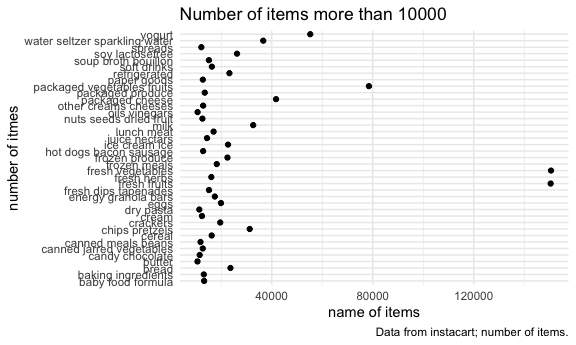
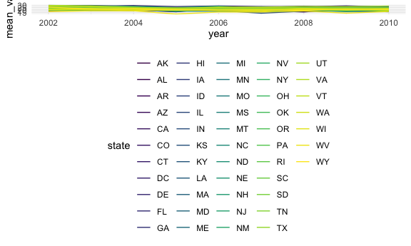
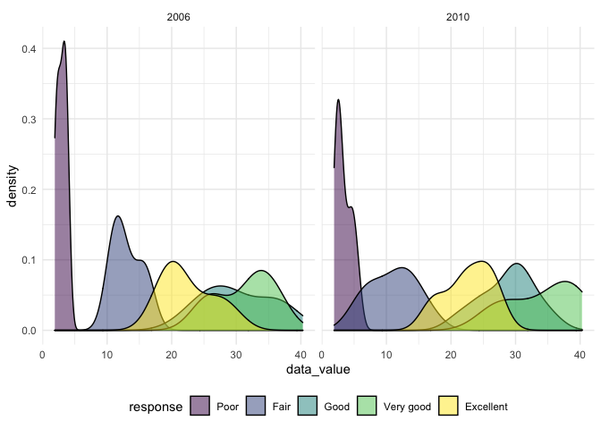
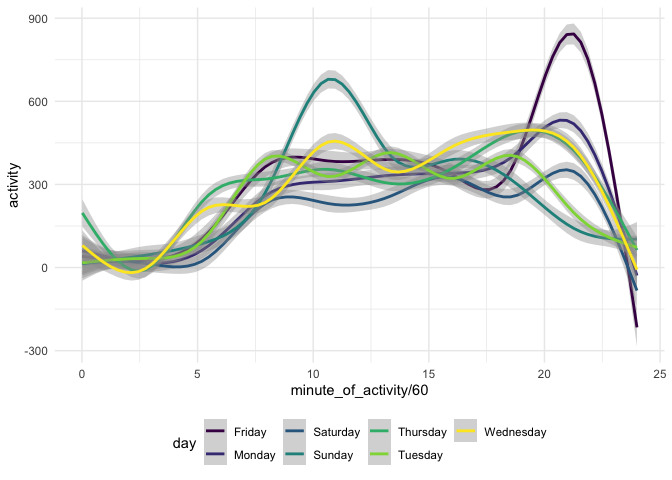

P8105\_hw3\_wl2829
================
Wentong
10/15/2021

## Problem 1

Load the data.

``` r
library(p8105.datasets)
data("instacart")
```

The instacart dataset contains 1384617 rows and 15 variables. This data
comes from shopping websites, showing the sales of different products in
different regions. The detail of information of product is clearly
showed by variables such as aisle, product\_name and product\_id. We can
also know the user and when the order was set. For example, the
Bulgarian Yogurt in dairy eggs department was bought by user 112108.
This order was nine days after the previous order and was finished on
the 4th day of the week.

### How many aisles are there, and which aisles are the most items ordered from?

``` r
instacart %>% 
  count(aisle_id) %>% 
  nrow()   ## The total number of aisles.
```

    ## [1] 134

``` r
instacart %>% 
  distinct() %>% 
  count(aisle, name = "aisle_n") %>% 
  mutate(aisle_n = as.numeric(aisle_n)) %>% 
  arrange(desc(aisle_n)) %>% ## rank the number of aisles
  filter(aisle_n == max(aisle_n)) ## pick the biggest number
```

    ## # A tibble: 1 × 2
    ##   aisle            aisle_n
    ##   <chr>              <dbl>
    ## 1 fresh vegetables  150609

“Fresh vegetables” has the most items. The number of orders is 150609.

### Make a plot that shows the number of items ordered in each aisle, limiting this to aisles with more than 10000 items ordered. Arrange aisles sensibly, and organize your plot so others can read it.

``` r
plot_df = 
  instacart %>% 
  distinct() %>% 
  count(aisle, name = "aisle_n") %>% 
  mutate(aisle_n = as.numeric(aisle_n)) %>% 
  filter(aisle_n >= 10000) %>% ## remove the data less than 10000
  arrange(desc(aisle_n)) %>% 
  mutate(
    aisle = factor(aisle),
    aisle = forcats::fct_reorder(aisle, sort(aisle_n))) %>% 
  ## control the factor
  ggplot(aes(x = aisle, y = aisle_n)) + 
  geom_point() + 
  coord_flip() +
  labs(
    title = "Number of items more than 10000",
    y = "number of itmes",
    x = "name of items",
    caption = "Data from instacart; number of items."
  ) ## make the plot readable

plot_df
```

<!-- --> We
can see from the plot that fresh vegetables and fresh fruits are the
most popular department in instacart. The number of most product is less
than 40000.

### Make a table showing the three most popular items in each of the aisles “baking ingredients”, “dog food care”, and “packaged vegetables fruits”. Include the number of times each item is ordered in your table.

``` r
Bi_df = 
  instacart %>% 
  filter(aisle == "baking ingredients") %>%   ## select the specific aisle
  count(product_name, name = "product_n") %>% ## count the number of each product
  arrange(desc(product_n)) %>% 
  head(3) %>% ## order the number and pick the three most popular items
  mutate(aisles_name = "baking ingredients") %>% 
  select(aisles_name, product_name, product_n) ## rearrange the table

dfc_df = 
  instacart %>% 
  filter(aisle == "dog food care") %>% 
  count(product_name, name = "product_n") %>% 
  arrange(desc(product_n)) %>% 
  head(3) %>% 
  mutate(aisles_name = "dog food care") %>% 
  select(aisles_name, product_name, product_n)

pvf_df = 
  instacart %>% 
  filter(aisle == "packaged vegetables fruits") %>% 
  count(product_name, name = "product_n") %>% 
  arrange(desc(product_n)) %>% 
  head(3) %>% 
  mutate(aisles_name = "packaged vegetables fruits") %>% 
  select(aisles_name, product_name, product_n)

three_aisles_df = 
  rbind(Bi_df, dfc_df, pvf_df) %>% 
  knitr::kable()

three_aisles_df
```

| aisles\_name               | product\_name                                 | product\_n |
|:---------------------------|:----------------------------------------------|-----------:|
| baking ingredients         | Light Brown Sugar                             |        499 |
| baking ingredients         | Pure Baking Soda                              |        387 |
| baking ingredients         | Cane Sugar                                    |        336 |
| dog food care              | Snack Sticks Chicken & Rice Recipe Dog Treats |         30 |
| dog food care              | Organix Chicken & Brown Rice Recipe           |         28 |
| dog food care              | Small Dog Biscuits                            |         26 |
| packaged vegetables fruits | Organic Baby Spinach                          |       9784 |
| packaged vegetables fruits | Organic Raspberries                           |       5546 |
| packaged vegetables fruits | Organic Blueberries                           |       4966 |

### Make a table showing the mean hour of the day at which Pink Lady Apples and Coffee Ice Cream are ordered on each day of the week; format this table for human readers (i.e. produce a 2 x 7 table).

``` r
mean_hour_df = 
  instacart %>% 
  filter(product_name %in% c("Coffee Ice Cream", "Pink Lady Apples")) %>% 
  ## select the data
  group_by(product_name, order_dow) %>% 
  summarize(
    mean_hour = mean(order_hour_of_day) 
  ) %>% ## calculate the mean of the data
  pivot_wider(
    names_from = order_dow,
    values_from = mean_hour
  ) %>% ## format the data to a 2 x 7 table
  rename("Sun" = "0","Mon" = "1", "Tue" = "2", "Wed" = "3", "Thu" = "4", 
         "Fri" = "5", "Sat" = "6") %>%  ## convert number to weekday name
  knitr::kable()
```

    ## `summarise()` has grouped output by 'product_name'. You can override using the `.groups` argument.

``` r
mean_hour_df
```

| product\_name    |      Sun |      Mon |      Tue |      Wed |      Thu |      Fri |      Sat |
|:-----------------|---------:|---------:|---------:|---------:|---------:|---------:|---------:|
| Coffee Ice Cream | 13.77419 | 14.31579 | 15.38095 | 15.31818 | 15.21739 | 12.26316 | 13.83333 |
| Pink Lady Apples | 13.44118 | 11.36000 | 11.70213 | 14.25000 | 11.55172 | 12.78431 | 11.93750 |

## Problem 2

Load the data

``` r
library(p8105.datasets)
```

``` r
BRFSS_df = 
  brfss_smart2010 %>% 
  janitor::clean_names() %>% 
  rename(state = locationabbr, specific_location = locationdesc) %>% 
  ## format the data to use appropriate variable names
  filter(topic == "Overall Health") %>% ## focus on the “Overall Health” topic
  filter(response %in% c("Excellent", "Very good", "Good", "Fair", "Poor")) %>%
  ## include only responses from “Excellent” to “Poor”
  mutate(response = factor(response), 
         response = forcats::fct_relevel(response, c("Poor", "Fair", "Good", "Very good", "Excellent"))) 
  ## organize responses as a factor taking levels ordered from “Poor” to “Excellent”

BRFSS_df
```

    ## # A tibble: 10,625 × 23
    ##     year state specific_location     class         topic question response sample_size
    ##    <int> <chr> <chr>                 <chr>         <chr> <chr>    <fct>          <int>
    ##  1  2010 AL    AL - Jefferson County Health Status Over… How is … Excelle…          94
    ##  2  2010 AL    AL - Jefferson County Health Status Over… How is … Very go…         148
    ##  3  2010 AL    AL - Jefferson County Health Status Over… How is … Good             208
    ##  4  2010 AL    AL - Jefferson County Health Status Over… How is … Fair             107
    ##  5  2010 AL    AL - Jefferson County Health Status Over… How is … Poor              45
    ##  6  2010 AL    AL - Mobile County    Health Status Over… How is … Excelle…          91
    ##  7  2010 AL    AL - Mobile County    Health Status Over… How is … Very go…         177
    ##  8  2010 AL    AL - Mobile County    Health Status Over… How is … Good             224
    ##  9  2010 AL    AL - Mobile County    Health Status Over… How is … Fair             120
    ## 10  2010 AL    AL - Mobile County    Health Status Over… How is … Poor              66
    ## # … with 10,615 more rows, and 15 more variables: data_value <dbl>,
    ## #   confidence_limit_low <dbl>, confidence_limit_high <dbl>,
    ## #   display_order <int>, data_value_unit <chr>, data_value_type <chr>,
    ## #   data_value_footnote_symbol <chr>, data_value_footnote <chr>,
    ## #   data_source <chr>, class_id <chr>, topic_id <chr>, location_id <chr>,
    ## #   question_id <chr>, respid <chr>, geo_location <chr>

### In 2002, which states were observed at 7 or more locations? What about in 2010?

``` r
BRFSS_df %>% 
  filter(year == 2002) %>% 
  select(state, specific_location) %>% 
  distinct() %>% 
  count(state, name = "ob_n") %>% 
  filter(ob_n >= 7) %>% 
  knitr::kable()
```

| state | ob\_n |
|:------|------:|
| CT    |     7 |
| FL    |     7 |
| MA    |     8 |
| NC    |     7 |
| NJ    |     8 |
| PA    |    10 |

``` r
## states were observed more than 7 in 2002


BRFSS_df %>% 
  filter(year == 2010) %>% 
  select(state, specific_location) %>% 
  distinct() %>% 
  count(state, name = "ob_n") %>% 
  filter(ob_n >= 7) %>% 
  knitr::kable()
```

| state | ob\_n |
|:------|------:|
| CA    |    12 |
| CO    |     7 |
| FL    |    41 |
| MA    |     9 |
| MD    |    12 |
| NC    |    12 |
| NE    |    10 |
| NJ    |    19 |
| NY    |     9 |
| OH    |     8 |
| PA    |     7 |
| SC    |     7 |
| TX    |    16 |
| WA    |    10 |

``` r
## states were observed more than 7 in 2010
```

### Construct a dataset that is limited to Excellent responses, and contains, year, state, and a variable that averages the data\_value across locations within a state. Make a “spaghetti” plot of this average value over time within a state.

``` r
BRFSS_df %>% 
  filter(response == "Excellent") %>% 
  group_by(year, state) %>% 
  mutate(
    mean_value = mean(data_value, na.rm = TRUE)
  ) %>% ## calculate the average value
  select(year, state, mean_value) %>% 
  distinct() %>% 
  ggplot(aes(x = year, y = mean_value)) +
  geom_line(aes(group = state, color = state))
```

<!-- -->

### Make a two-panel plot showing, for the years 2006, and 2010, distribution of data\_value for responses among locations in NY State.

``` r
two_panel_plot = 
  BRFSS_df %>% 
  filter(year %in% c(2006, 2010)) %>% 
  ## select the 2006 and 2010 data
  filter(state == "NY") %>% 
  ggplot(aes(x = data_value, fill = response)) +
  geom_density(alpha = .5) +
  facet_grid(. ~ year)
  ## make a two-panel plot

two_panel_plot
```

<!-- -->

## Problem 3

### Load, tidy, and otherwise wrangle the data. Your final dataset should include all originally observed variables and values; have useful variable names; include a weekday vs weekend variable; and encode data with reasonable variable classes.

``` r
acce_df = 
  read_csv("./data/accel_data.csv") %>% ## load the data
  pivot_longer(
    activity.1:activity.1440,
    names_to = "minute_of_activity",
    values_to = "activity"  
  ) %>% ## reduce the number of variables to make the data more clear
  janitor::clean_names() %>% 
  mutate_at("minute_of_activity", str_replace, "activity.", "") %>%
  ## remove the useless part of the data
  mutate(day_type = case_when(
    day %in% c("Friday", "Monday", "Tuesday", "Wednesday", "Thursday") ~ "weekday",
    day %in% c("Saturday", "Sunday") ~ "weekend"
  )) %>%  ## add a weekday vs weekend variable
  mutate(minute_of_activity = as.numeric(minute_of_activity))
```

    ## Rows: 35 Columns: 1443

    ## ── Column specification ────────────────────────────────────────────────────────
    ## Delimiter: ","
    ## chr    (1): day
    ## dbl (1442): week, day_id, activity.1, activity.2, activity.3, activity.4, ac...

    ## 
    ## ℹ Use `spec()` to retrieve the full column specification for this data.
    ## ℹ Specify the column types or set `show_col_types = FALSE` to quiet this message.

``` r
  ## encode data with reasonable variable classes

acce_df
```

    ## # A tibble: 50,400 × 6
    ##     week day_id day    minute_of_activity activity day_type
    ##    <dbl>  <dbl> <chr>               <dbl>    <dbl> <chr>   
    ##  1     1      1 Friday                  1     88.4 weekday 
    ##  2     1      1 Friday                  2     82.2 weekday 
    ##  3     1      1 Friday                  3     64.4 weekday 
    ##  4     1      1 Friday                  4     70.0 weekday 
    ##  5     1      1 Friday                  5     75.0 weekday 
    ##  6     1      1 Friday                  6     66.3 weekday 
    ##  7     1      1 Friday                  7     53.8 weekday 
    ##  8     1      1 Friday                  8     47.8 weekday 
    ##  9     1      1 Friday                  9     55.5 weekday 
    ## 10     1      1 Friday                 10     43.0 weekday 
    ## # … with 50,390 more rows

### Traditional analyses of accelerometer data focus on the total activity over the day. Using your tidied dataset, aggregate accross minutes to create a total activity variable for each day, and create a table showing these totals. Are any trends apparent?

``` r
acce_df %>% 
  group_by(day_id) %>% 
  mutate(day_sum = sum(activity)) %>% 
  ## create a total activity variable for each day
  select(day_id, day_type, day, day_sum) %>% 
  distinct() %>% 
  knitr::kable()
```

| day\_id | day\_type | day       |  day\_sum |
|--------:|:----------|:----------|----------:|
|       1 | weekday   | Friday    | 480542.62 |
|       2 | weekday   | Monday    |  78828.07 |
|       3 | weekend   | Saturday  | 376254.00 |
|       4 | weekend   | Sunday    | 631105.00 |
|       5 | weekday   | Thursday  | 355923.64 |
|       6 | weekday   | Tuesday   | 307094.24 |
|       7 | weekday   | Wednesday | 340115.01 |
|       8 | weekday   | Friday    | 568839.00 |
|       9 | weekday   | Monday    | 295431.00 |
|      10 | weekend   | Saturday  | 607175.00 |
|      11 | weekend   | Sunday    | 422018.00 |
|      12 | weekday   | Thursday  | 474048.00 |
|      13 | weekday   | Tuesday   | 423245.00 |
|      14 | weekday   | Wednesday | 440962.00 |
|      15 | weekday   | Friday    | 467420.00 |
|      16 | weekday   | Monday    | 685910.00 |
|      17 | weekend   | Saturday  | 382928.00 |
|      18 | weekend   | Sunday    | 467052.00 |
|      19 | weekday   | Thursday  | 371230.00 |
|      20 | weekday   | Tuesday   | 381507.00 |
|      21 | weekday   | Wednesday | 468869.00 |
|      22 | weekday   | Friday    | 154049.00 |
|      23 | weekday   | Monday    | 409450.00 |
|      24 | weekend   | Saturday  |   1440.00 |
|      25 | weekend   | Sunday    | 260617.00 |
|      26 | weekday   | Thursday  | 340291.00 |
|      27 | weekday   | Tuesday   | 319568.00 |
|      28 | weekday   | Wednesday | 434460.00 |
|      29 | weekday   | Friday    | 620860.00 |
|      30 | weekday   | Monday    | 389080.00 |
|      31 | weekend   | Saturday  |   1440.00 |
|      32 | weekend   | Sunday    | 138421.00 |
|      33 | weekday   | Thursday  | 549658.00 |
|      34 | weekday   | Tuesday   | 367824.00 |
|      35 | weekday   | Wednesday | 445366.00 |

he data in the table does not show a clear trend of data changes, but
the total amount in certain days is relatively low, especially on
Saturdays in the fourth and fifth weeks

### Accelerometer data allows the inspection activity over the course of the day. Make a single-panel plot that shows the 24-hour activity time courses for each day and use color to indicate day of the week.

``` r
acce_df %>% 
  group_by(day_id) %>% 
  mutate(day_sum = sum(activity)) %>% 
  select(week, day, day_sum) %>% 
  distinct() %>% 
  ggplot(aes(x = week, y = day_sum, color = day)) +
  geom_line() +
  geom_point()
```

    ## Adding missing grouping variables: `day_id`

<!-- -->
This plot shows that the fluctuation of each day’s data in different
weeks is very obvious. However, their changing trends are very
different. At the same time, the data gap at different times within a
week is also relatively large. The data in the figure does not show a
very obvious trend or law.
