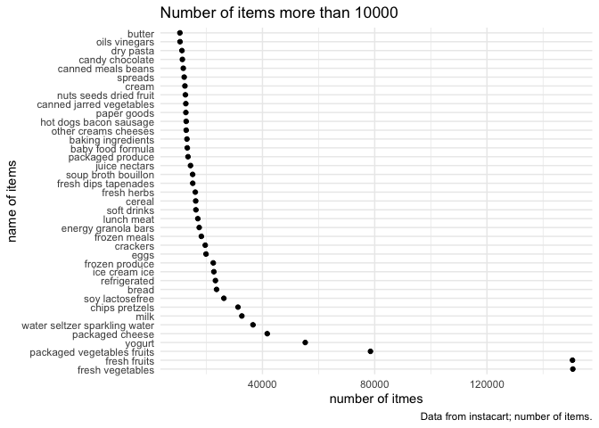
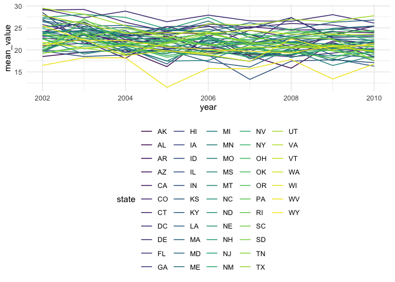

P8105\_hw3\_wl2829
================
Wentong
10/15/2021

``` r
library(tidyverse)
```

    ## ── Attaching packages ─────────────────────────────────────── tidyverse 1.3.1 ──

    ## ✓ ggplot2 3.3.5     ✓ purrr   0.3.4
    ## ✓ tibble  3.1.4     ✓ dplyr   1.0.7
    ## ✓ tidyr   1.1.3     ✓ stringr 1.4.0
    ## ✓ readr   2.0.1     ✓ forcats 0.5.1

    ## ── Conflicts ────────────────────────────────────────── tidyverse_conflicts() ──
    ## x dplyr::filter() masks stats::filter()
    ## x dplyr::lag()    masks stats::lag()

``` r
library(dplyr)
library(stringr)

knitr::opts_chunk$set(
  fig.width = 6,
  fig.asp = .6,
  out.width = "90%"
)

theme_set(theme_minimal() + theme(legend.position = "bottom"))

options(
  ggplot2.continuous.colour = "viridis",
  ggplot2.continuous.fill = "viridis"
)

scale_colour_discrete = scale_colour_viridis_d
scale_fill_discrete = scale_fill_viridis_d
```

## Problem 1

Load the data.

``` r
library(p8105.datasets)
data("instacart")
```

The instacart dataset contains 1384617 rows and 15 variables. This data
comes from shopping websites, showing the sales of different products in
different regions. The detail of information of product is clearly
showed by variables such as aisle, product\_name and product\_id. We can
also know the user and when the order was set. For example, the
Bulgarian Yogurt in dairy eggs department was bought by user 112108.
This order was nine days after the previous order and was finished on
the 4th day of the week.

## knitr::kable()

### How many aisles are there, and which aisles are the most items ordered from?

``` r
instacart %>% 
  count(aisle_id) %>% 
  nrow()   ## The total number of aisles.
```

    ## [1] 134

``` r
instacart %>% 
  distinct() %>% 
  count(aisle, name = "aisle_n") %>% 
  mutate(aisle_n = as.numeric(aisle_n)) %>% 
  arrange(desc(aisle_n)) %>% ## rank the number of aisles
  filter(aisle_n == max(aisle_n)) ## pick the biggest number
```

    ## # A tibble: 1 × 2
    ##   aisle            aisle_n
    ##   <chr>              <dbl>
    ## 1 fresh vegetables  150609

“Fresh vegetables” has the most items. The number of orders is 150609.

### Make a plot that shows the number of items ordered in each aisle, limiting this to aisles with more than 10000 items ordered. Arrange aisles sensibly, and organize your plot so others can read it.

``` r
plot_df = 
  instacart %>% 
  distinct() %>% 
  count(aisle, name = "aisle_n") %>% 
  mutate(aisle_n = as.numeric(aisle_n)) %>% 
  filter(aisle_n >= 10000) %>% ## remove the data less than 10000
  arrange(desc(aisle_n)) %>% 
  mutate(
    aisle = factor(aisle),
    aisle = forcats::fct_reorder(aisle, sort(aisle_n))) %>% 
  ## control the factor
  ggplot(aes(x = aisle, y = aisle_n)) + 
  geom_point() + 
  coord_flip() +
  labs(
    title = "Number of items more than 10000",
    x = "number of itmes",
    y = "name of items",
    caption = "Data from instacart; number of items."
  ) ## make the plot readable

plot_df
```


We can see from the plot that fresh vegetables and fresh fruits are the
most popular department in instacart.

### Make a table showing the three most popular items in each of the aisles “baking ingredients”, “dog food care”, and “packaged vegetables fruits”. Include the number of times each item is ordered in your table.

``` r
Bi_df = 
  instacart %>% 
  filter(aisle == "baking ingredients") %>%   ## select the specific aisle
  count(product_name, name = "product_n") %>% ## count the number of each product
  arrange(desc(product_n)) %>% 
  head(3) %>% ## order the number and pick the three most popular items
  mutate(aisles_name = "baking ingredients") %>% 
  select(aisles_name, product_name, product_n) ## rearrange the table

dfc_df = 
  instacart %>% 
  filter(aisle == "dog food care") %>% 
  count(product_name, name = "product_n") %>% 
  arrange(desc(product_n)) %>% 
  head(3) %>% 
  mutate(aisles_name = "dog food care") %>% 
  select(aisles_name, product_name, product_n)

pvf_df = 
  instacart %>% 
  filter(aisle == "packaged vegetables fruits") %>% 
  count(product_name, name = "product_n") %>% 
  arrange(desc(product_n)) %>% 
  head(3) %>% 
  mutate(aisles_name = "packaged vegetables fruits") %>% 
  select(aisles_name, product_name, product_n)

three_aisles_df = 
  rbind(Bi_df, dfc_df, pvf_df)
```

### Make a table showing the mean hour of the day at which Pink Lady Apples and Coffee Ice Cream are ordered on each day of the week; format this table for human readers (i.e. produce a 2 x 7 table).

``` r
mean_hour_df = 
  instacart %>% 
  filter(product_name %in% c("Coffee Ice Cream", "Pink Lady Apples")) %>% 
  ## select the data
  group_by(product_name, order_dow) %>% 
  summarize(
    mean_hour = mean(order_hour_of_day) 
  ) %>% ## 
  pivot_wider(
    names_from = order_dow,
    values_from = mean_hour
  ) %>% ## format the data to a 2 x 7 table
  rename("Sun" = "0","Mon" = "1", "Tue" = "2", "Wed" = "3", "Thu" = "4", 
         "Fri" = "5", "Sat" = "6") ## convert number to weekday name
```

    ## `summarise()` has grouped output by 'product_name'. You can override using the `.groups` argument.

## Problem 2

Load the data

``` r
library(p8105.datasets)
```

``` r
BRFSS_df = 
  brfss_smart2010 %>% 
  janitor::clean_names() %>% 
  rename(state = locationabbr, specific_location = locationdesc) %>% 
  ## change the variables' name
  filter(topic == "Overall Health") %>% ## focus on the “Overall Health” topic
  filter(response %in% c("Excellent", "Very good", "Good", "Fair", "Poor")) %>%
  ## include only responses from “Excellent” to “Poor”
  mutate(response = factor(response), 
         response = forcats::fct_relevel(response, c("Poor", "Fair", "Good", "Very good", "Excellent"))) ## organize responses as a factor taking levels ordered from “Poor” to “Excellent”
```

### In 2002, which states were observed at 7 or more locations? What about in 2010?

``` r
BRFSS_df %>% 
  filter(year == 2002) %>% 
  select(state, specific_location) %>% 
  distinct() %>% 
  count(state, name = "ob_n") %>% 
  filter(ob_n >= 7)
```

    ## # A tibble: 6 × 2
    ##   state  ob_n
    ##   <chr> <int>
    ## 1 CT        7
    ## 2 FL        7
    ## 3 MA        8
    ## 4 NC        7
    ## 5 NJ        8
    ## 6 PA       10

``` r
BRFSS_df %>% 
  filter(year == 2010) %>% 
  select(state, specific_location) %>% 
  distinct() %>% 
  count(state, name = "ob_n") %>% 
  filter(ob_n >= 7)
```

    ## # A tibble: 14 × 2
    ##    state  ob_n
    ##    <chr> <int>
    ##  1 CA       12
    ##  2 CO        7
    ##  3 FL       41
    ##  4 MA        9
    ##  5 MD       12
    ##  6 NC       12
    ##  7 NE       10
    ##  8 NJ       19
    ##  9 NY        9
    ## 10 OH        8
    ## 11 PA        7
    ## 12 SC        7
    ## 13 TX       16
    ## 14 WA       10

``` r
BRFSS_df %>% 
  filter(response == "Excellent") %>% 
  group_by(year, state) %>% 
  mutate(
    mean_value = mean(data_value, na.rm = TRUE)
  ) %>% 
  select(year, state, mean_value) %>% 
  distinct() %>% 
  ggplot(aes(x = year, y = mean_value)) +
  geom_line(aes(group = state, color = state))
```



``` r
two_panel_plot = 
  BRFSS_df %>% 
  filter(year %in% c(2006, 2010)) %>% 
  filter(state == "NY") %>% 
  ggplot(aes(x = data_value, fill = response)) +
  geom_density(alpha = .5) +
  facet_grid(. ~ year) 
```

## Problem 3

### Load, tidy, and otherwise wrangle the data. Your final dataset should include all originally observed variables and values; have useful variable names; include a weekday vs weekend variable; and encode data with reasonable variable classes.

``` r
acce_df = 
  read_csv("./data/accel_data.csv") %>% ## load the data
  pivot_longer(
    activity.1:activity.1440,
    names_to = "minute_of_activity",
    values_to = "activity"  
  ) %>% ## reduce the number of variables to make the data more clear
  janitor::clean_names() %>% 
  mutate_at("minute_of_activity", str_replace, "activity.", "") %>% 
  mutate(day_type = case_when(
    day %in% c("Friday", "Monday", "Tuesday", "Wednesday", "Thursday") ~ "weekday",
    day %in% c("Saturday", "Sunday") ~ "weekend"
  )) 
```

    ## Rows: 35 Columns: 1443

    ## ── Column specification ────────────────────────────────────────────────────────
    ## Delimiter: ","
    ## chr    (1): day
    ## dbl (1442): week, day_id, activity.1, activity.2, activity.3, activity.4, ac...

    ## 
    ## ℹ Use `spec()` to retrieve the full column specification for this data.
    ## ℹ Specify the column types or set `show_col_types = FALSE` to quiet this message.

### Traditional analyses of accelerometer data focus on the total activity over the day. Using your tidied dataset, aggregate accross minutes to create a total activity variable for each day, and create a table showing these totals. Are any trends apparent?

``` r
total_act_df = 
  acce_df %>% 
  group_by(day_id) %>% 
  mutate(day_sum = sum(activity)) %>% 
  select(day_id, day_type, day, day_sum) %>% 
  distinct() %>% 
  knitr::kable()
```

### Accelerometer data allows the inspection activity over the course of the day. Make a single-panel plot that shows the 24-hour activity time courses for each day and use color to indicate day of the week. Describe in words any patterns or conclusions you can make based on this graph.
